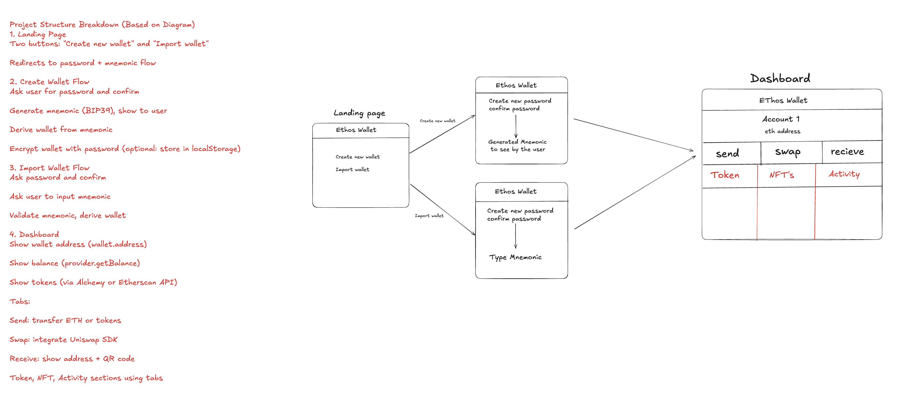

# 🦊 Ethos Wallet

Ethos Wallet is a sleek, secure, and minimal Ethereum wallet built with **Next.js**, **TypeScript**, and **TailwindCSS**. Users can **create** or **import** wallets using 12-word mnemonic phrases. Once logged in, they access a modern dashboard to **send**, **receive**, **swap** tokens, and view **NFTs** and **transaction history**.

---

## 📸 App Flow Diagram




---

## 🧱 Project Structure Breakdown (Based on Diagram)

### 1. Landing Page

- Displays two options:
  - **Create new wallet**
  - **Import wallet**
- Each leads to its respective password + mnemonic flow.

---

### 2. Create Wallet Flow

- Ask the user to **create a password** and **confirm** it.
- **Generate a 12-word mnemonic** using `bip39`.
- Display mnemonic to the user in a clean, boxed layout.
- Derive the wallet from the mnemonic using `ethers.js`.
- (Optional) Encrypt the wallet with the password and store it in `localStorage`.

---

### 3. Import Wallet Flow

- Ask the user to **create a password** and **confirm** it.
- Prompt user to **input their 12-word mnemonic**.
- Validate the mnemonic format.
- Derive the wallet using `ethers.js`.
- (Optional) Store encrypted wallet in `localStorage`.

---

### 4. Dashboard

Display wallet data and provide core features:

- **Wallet address**
- **ETH balance** using `provider.getBalance()`
- **Tokens & NFTs** using **Alchemy** or **Etherscan API**

#### Tabs:
- **Send**: Transfer ETH or any ERC-20 token
- **Swap**: Token swapping via **Uniswap SDK**
- **Receive**: Show wallet address & QR code
- **Tokens, NFTs, Activity**: Separate tabs for clarity

---

## 🛠 Tech Stack

- ✅ Next.js (React framework)
- ✅ TypeScript
- ✅ TailwindCSS
- ✅ `ethers.js` — Wallet derivation and blockchain interaction
- ✅ `bip39` — Mnemonic phrase generation & validation
- ✅ Uniswap SDK — For on-chain swaps
- ✅ Alchemy / Etherscan API — Token and NFT data

---

## 🚀 Getting Started

### 1. Clone the repository

```bash
git clone https://github.com/your-username/ethos-wallet.git
cd ethos-wallet


